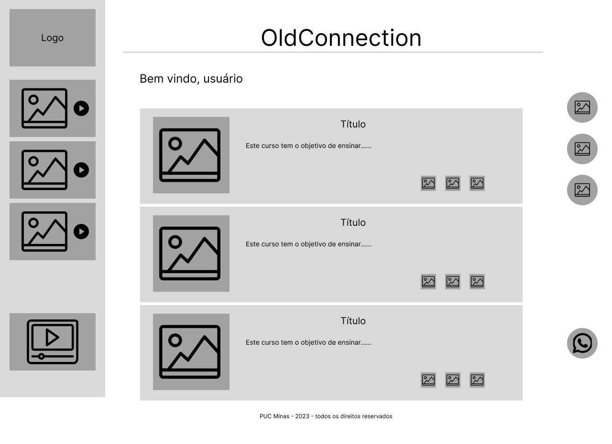
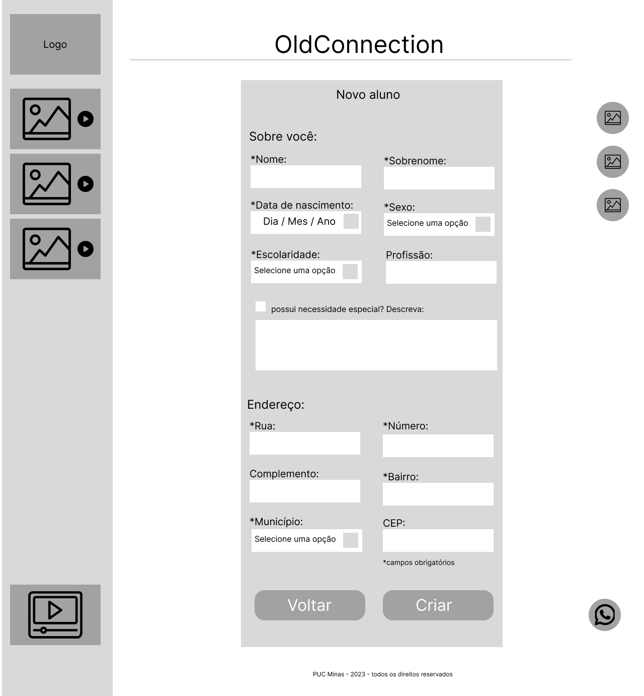

# Projeto de Interface

Visão geral da interação do usuário pelas telas do sistema e protótipo interativo das telas com as funcionalidades que fazem parte do sistema (wireframes).

 Apresente as principais interfaces da plataforma. Discuta como ela foi elaborada de forma a atender os requisitos funcionais, não funcionais e histórias de usuário abordados nas <a href="2-Especificação do Projeto.md"> Documentação de Especificação</a>.

## User Flow

## Wireframes

### Template

### Tela inicial do Aluno/Responsavel

### Tela de Login

### Tela de cadastro do Responsável

### Tela de Cadastro do Aluno

### Tela de Inicial do Orientador

### Exemplo

 

